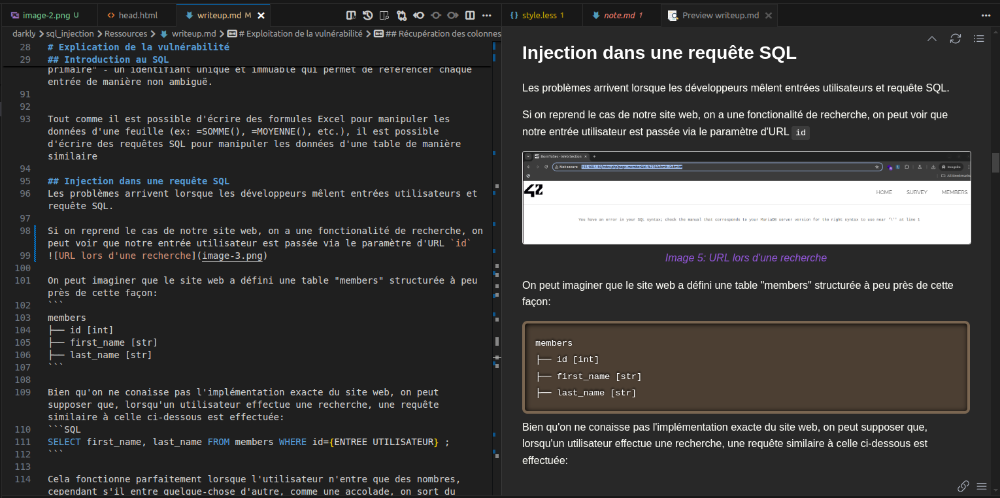

Just my setup for the Markdown Preview Enhanced vscode extension.

I hate using Obsidian and found that using this extension along with a bit of customization makes notes-taking in markdown extremely simple and convenient for my use-cases

The custom HTLM adds zooming when clicking on images, and displays the alt-text as captions, making it look like a regular pentest report.

### Preview:
